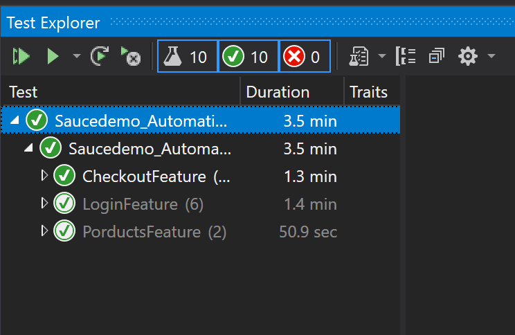

# Website_Automation_Testing
Automation tests carried out on saucedemo.com using NUNit and SpecFlow within Visual Studio
# Project Overview
This project looks to test the fastest route for a customer to purchase an item on a website. It will test feature such as loggin in, selecting items, to checking out and providing the user with an overview of their order
# Class Diagram

# Tests

## Project review
The project was not too challenging in terms of creating the framework. There were alot of challenges in terms of creating POMs in terms of identifying elements on the webpage by id, classname or cssselector an d trying to avoiding using the xpath. The decision on the types of tests I carried out was based on simplicity on operation. Granted it was alot easier due to the lack of dependency of webpages on each other. This meant i didint have to transfer my driver between my POMs. 
## Project Retrospective
Successes of the project came in testing the majority of the purchasing process for the website. I was able to test different components on each othe pages I created POMs for. This was beneficial ask it gave me a greater understadning of hwo to test webpages based on the driver and IWebElements I identified in each POM. However, failure came forth as the entire functionality of the webiste was not tested due to time constraints. I would have wanted to test more content on the product page and tests the different login page that were presented to the differnt users and not just the simple success or failure of login. I would have also like to test the login featur ein more detials by testing differences between the username and the password
# How to use the framework
## Packages
- NUnit
- NUnitTest3Adapter
- Specflow
- Specflow.Chrome
## app.config
- create value key pair within app settings
- set the value to the url of the webpage you wish to test
## AppConfigReader
- create a static readonly property for the webpage(url) you wish to test
- assign the url from your 'app.config' class using the configuration manager

