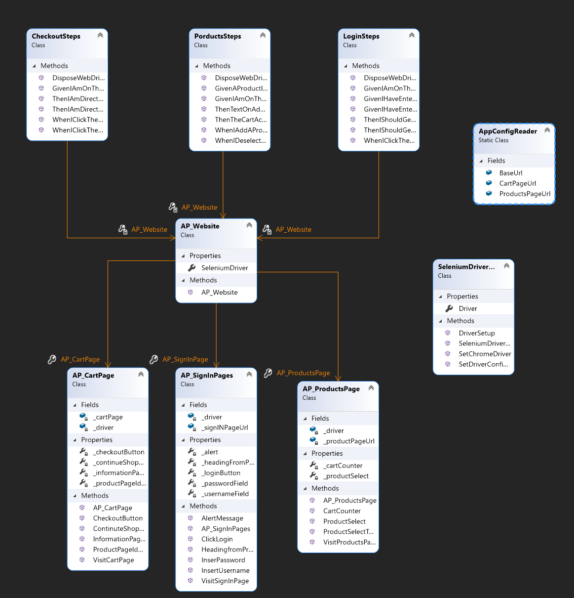

# Website_Automation_Testing
Automation tests carried out on saucedemo.com using NUNit and SpecFlow within Visual Studio
# Project Overview
This project looks to test the fastest route for a customer to purchase an item on a website. It will test feature such as loggin in, selecting items, to checking out and providing the user with an overview of their order
# Class Diagram

## Project review

## Project Retrospective
# How to use the framework
## Packages
- NUnit
- NUnitTest3Adapter
- Specflow
- Specflow.Chrome
## app.config
- create value key pair within app settings
- set the value to the url of the webpage you wish to test
## AppConfigReader
- create a static readonly property for the webpage(url) you wish to test
- assign the url from your 'app.config' class using the configuration manager

